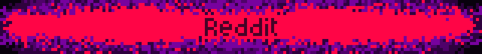
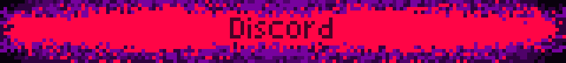
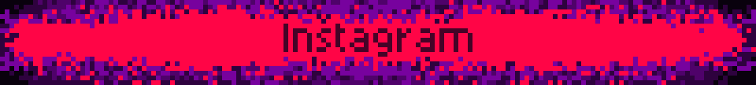
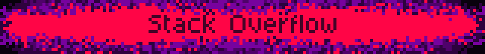

  

  

  

<table>
  <tr>
    <td align="center" width="30%">
      
    </td>
    <td>
      
       
      
       
      
       
      
    </td>
  </tr>
</table>

  
  <!-- GitHub Streak -->
  <table>
    <tr>
      <td>
        
      </td>
      <td>
        
      </td>
    </tr>
  </table>
  
  <!-- GitHub Activity Graph -->
  

